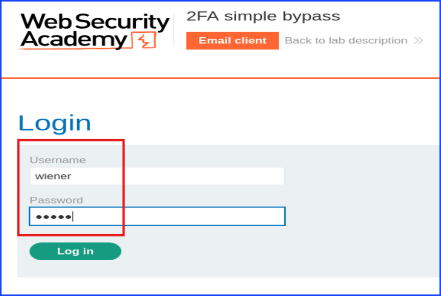
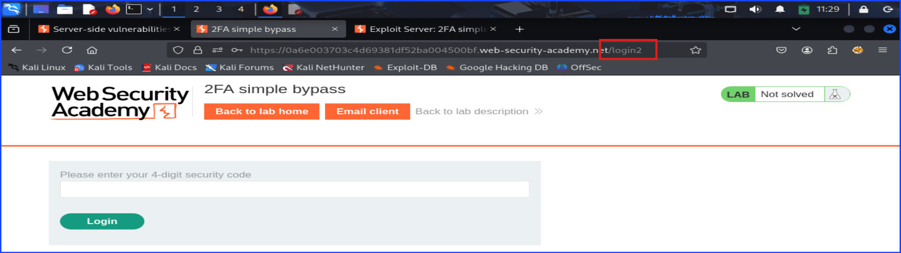
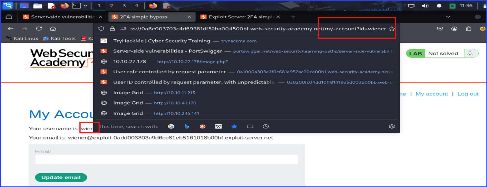
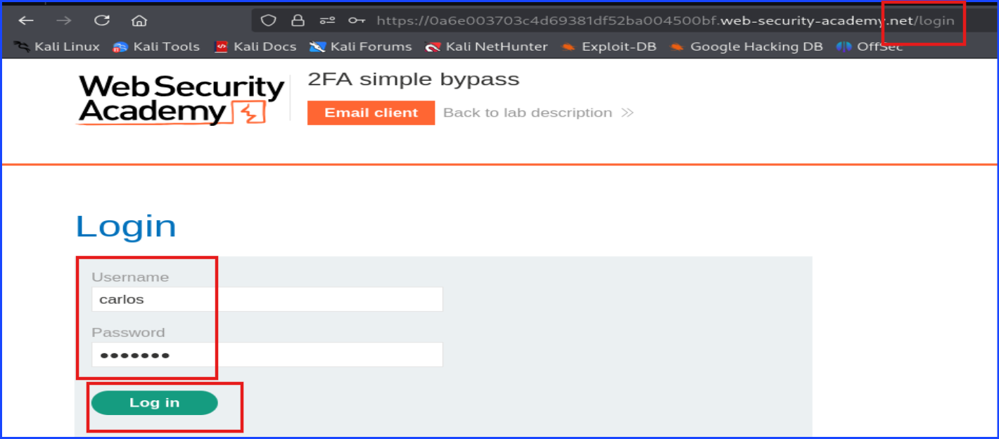
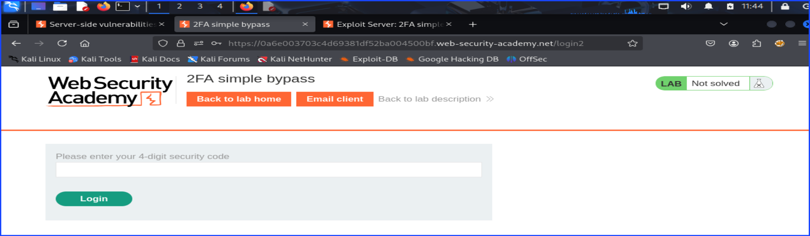
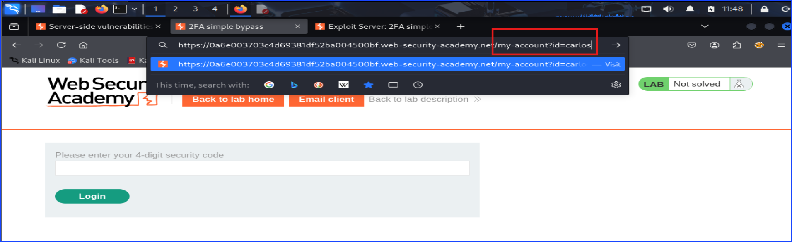
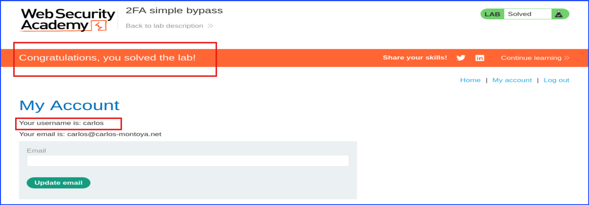

# Lab: 2FA Simple ByPass

**Lab:** Port Swigger Academy

After navigating to the lab URL, I started off by heading to the account login and log into the given account's username: `wiener` as shown in the screenshot below.

After logging into `wiener` account, take a look around, you will see `/login2` in the URL and a prompt asking for the 4-digits security code.

The intended idea is for us to click on the `Email client` to get the 4-digits security and fill it on this page's prompt. Then, the page will send you to the next page. Our goal is to reach the page after this page without filling in those 4-digits security code when login to another user.

For now, click on the `Email client` to get the security digits. Then, enters those 4-digits into the prompt.

At this point, the process of logging in as the user `wiener` is considered as successful.

Now take a look at the URL as shown in the screenshot below. Copy the URL especially the part that written as `/my-account?id=wiener`. This URL indicates a successful logging-in of a specific user ID; in this case it is user `wiener`.

Log back out and log back in as user Carlos with the credential we were given from the task. In a real hacking, this is the credential we obtain from other methods, but for the scope of this lab, our learning is focusing on bypassing the 2FA so the credential were given.

Once I was able to log in, I was greeted with the 4-digits security prompt like when I login as `wiener`. The real hacking of this scenario, we are likely don't have accessed to Carlos's email so we cannot click on the `Email client` button for Carlos to get the 4-digits security code.

To bypass a simple 2FA, change the `login2` to the URL we copied or remembered earlier. That one was `my-account?id=wiener`, but instead of using the `id=wiener`, change it to `id=carlos` and hit enter to navigate to the dashboard as shown in the screenshot below.

Now I have successfully login as Carlos and solved the lab as shown in the screenshot below.

## Mitigation Strategies

+ Bind 2FA to Session State
  + Enforce that the 2FA verification step sets a secure session flag (e.g., `2fa_verified = true`) after successful code entry.
  + Only allow access to protected pages (e.g., `/my-account`) **if 2FA has been verified.**

+ Use Strong Server-Side Access Controls
  + Do not rely solely on URL parameters (like `?id=carlos`) for user authentication.
  + Access to user resources should be determined based on the session, not user input.

+ Regenerate Session Tokens After Authentication Steps
  + Regenerate the session ID after successful password login and again after successful 2FA.
  + Prevents session fixation and makes session hijacking harder.

+ Disable Direct Access to Internal URLs
  + Restrict access to URLs like `/my-account` unless all authentication steps (including 2FA) have been completed.

+ Avoid Leaking Information via URLs
  + Avoid passing user identifiers (`?id=wiener`) in URLs that control access to user-specific pages.

---

**Author:** Sangsongthong C.
**Publish Date:** 18 May 2025
