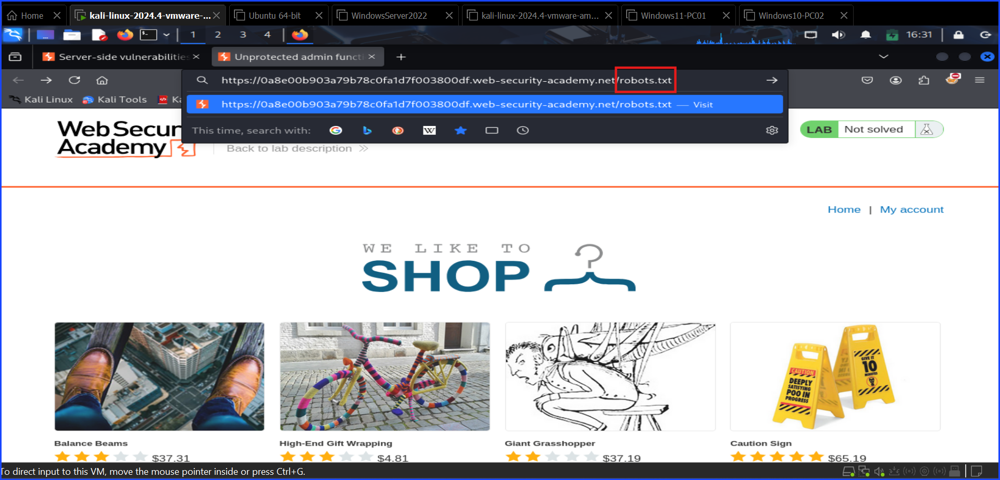
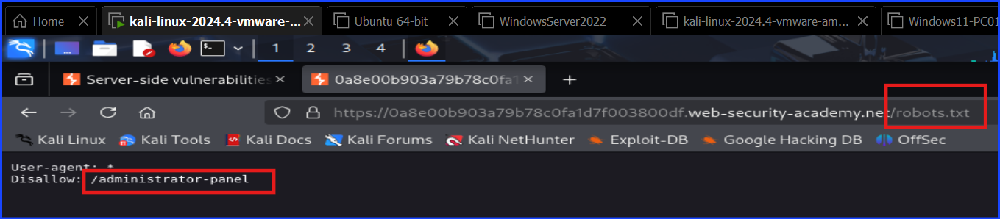
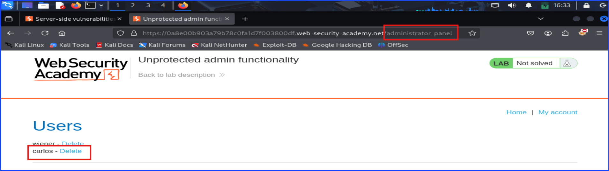
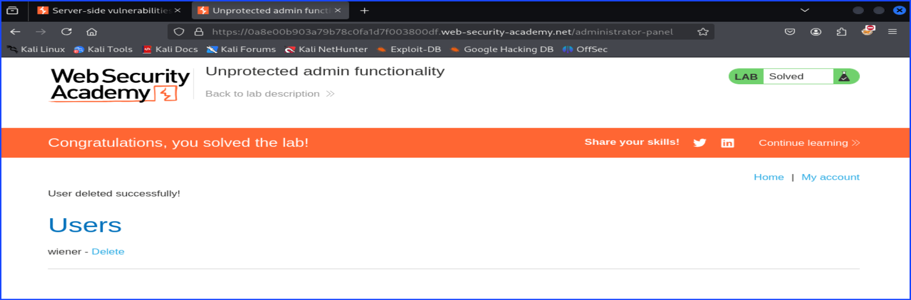

# Access Control: Lab 1 Unprotected Admin Functionality

This lab is very short and easy to test. It is considered as a low hanging fruit.

I started off by navigating to the lab. The general idea is to check the `robots.txt` to see if site shows any information that it shouldn't.

I can do that by manually adding `robots.txt` at the end of the website's URL in the URL bar in the web browser as you can see in the screenshot below.

After navigating to `robots.txt`, you can see the `Disallow: /administrator-panel` text written. For security purpose, if the administrator panel is meant to be hidden, writing it here and hope to hide it isn't enough because it is very easy for an attacker to discover it. This is shown in the screenshot below.

After getting the location of the administrator's panel from `robots.txt`, I navigated there and deleted a user's name `Carlos`. It was surprisingly easy.

The screenshot below showed my success after solving the lab. This happened after I deleted the user `Carlos` from the administrator's panel.

## Mitigation

+ Remove or do not write administrator-panel's URL location in `robots.txt`.
