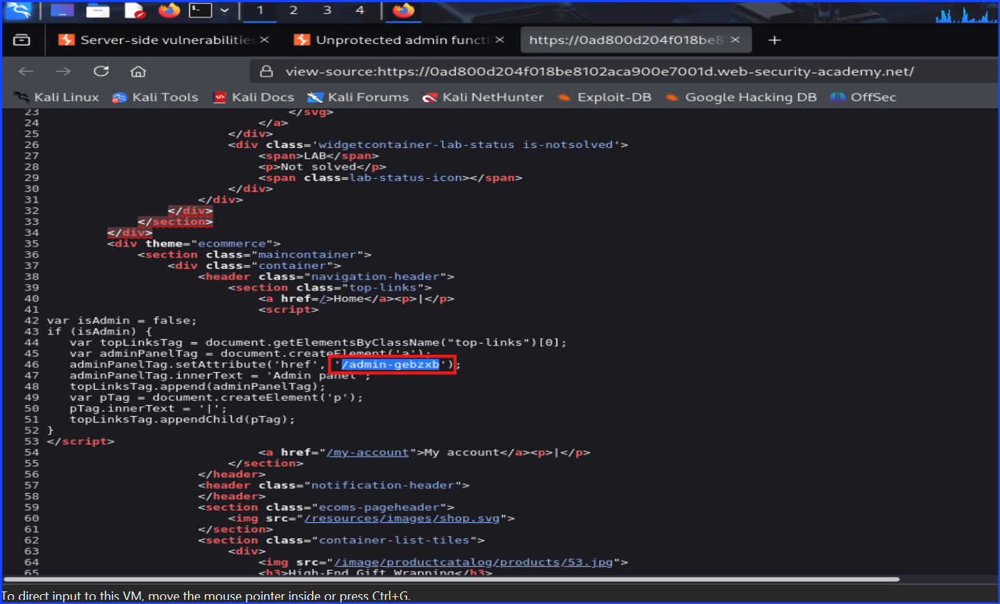
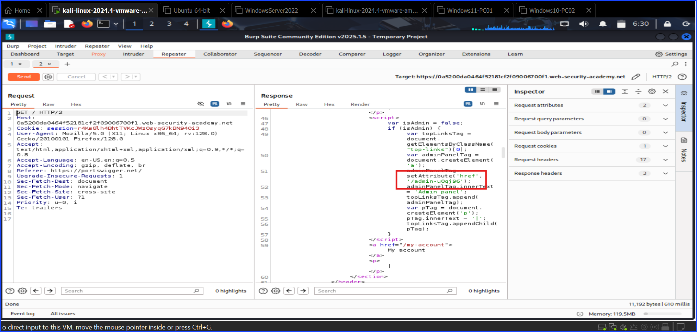
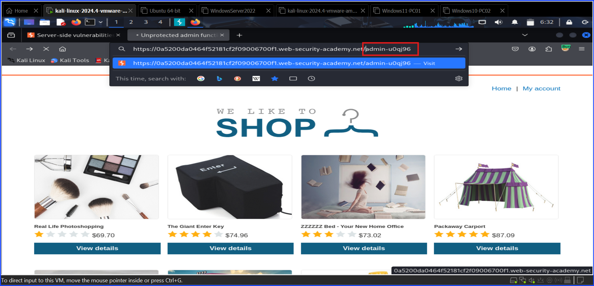
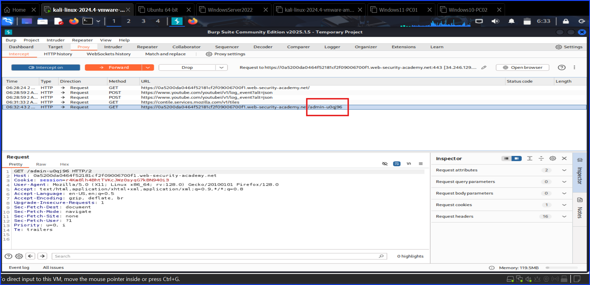
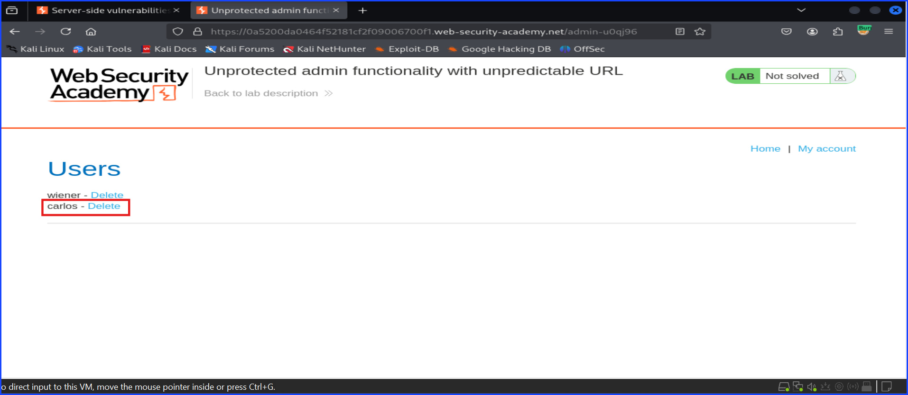
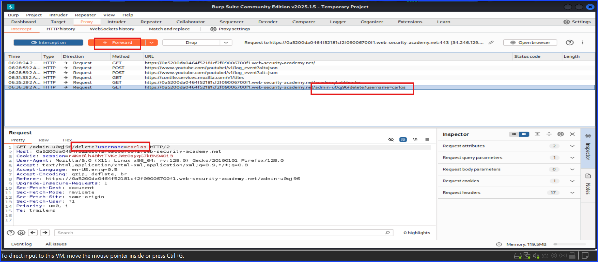
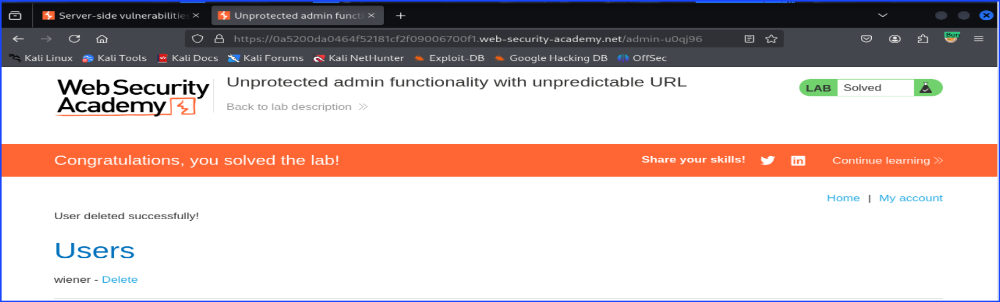

# Lab: Unprotected Admin Functionality With Unpredictable URL

I started off with navigated to the lab URL. Before I progress further, administrator panel with unpredictable URL is a attempt to hide `admin` panel by adding random string characters at the end of the URL and hiding it in the source code. This is a form of security by obsecurity hoping that attackers will not find it.

I found that there are 2 methods to solve this lab.

## Method 1 Not Using Burp Suite

I looked at the page source directly from the web browser and found admin's URL in the source code as shown in the below screenshot.

After that I copied the admin's URL and pasted it in the URL bar of the lab. There I can access the admin's panel.

I can delete user Carlos from the admin's panel right away and solve this lab.

## Method 2 Use Burp Suite

I started off by turning Burp Suite on. Then, I turned Burp Proxy on - ready to capture the traffic.

Then, back to Burp Suite, I navigated to `Proxy` tab and turn the traffic capture toggle on.

Then I went back to the browser and refreshed the page to capture the traffic with Burp Suite. After that I send the traffic that I capture to the repeater to see the response and view the source code.
You can see it in the below screenshot.

After seeing the admin panel's URL in Burp Suite, I copied and pasted it on the URL bar in the browser as shown in the below screenshot.

Then, click `forward` until you can see the admin panel on the web browser. You might need to click more than once. If your Burp capture none-related page, the trick is to look at the URL at the end that has the word `admin` in it as you can see in the screenshot below.

Now that you can the admin panel, you can delete Carlos. The trick is to click the delete button to delete Carlos right away without turning Burp Proxy or Burp Capture off. I tried to do that and it can cause some buggy issues.

You can see the admin panel with Carlos's name still there in the screenshot below.

Once you clicked `delete`, Burp Suite will still capture the traffic causing the page to froze. Do not panic. Just navigate to Burp and find the right request and click `forward`.

The trick is to look for the request that has the keyword `delete` and `carlos` in it as shown in the screenshot below and click `forward`.

Now you have solved the lab. Carlos is being deleted from the system.

## Mitigation

+ Use other method to secure admin's panel.
