# Lab 3: User Role Controlled By Request Parameter

***Port Swigger Accademy Lab***

After navigating to the lab's URL, I started off by logining into the login panel using the given credential: `wiener:peter`as shown in the screenshot below.

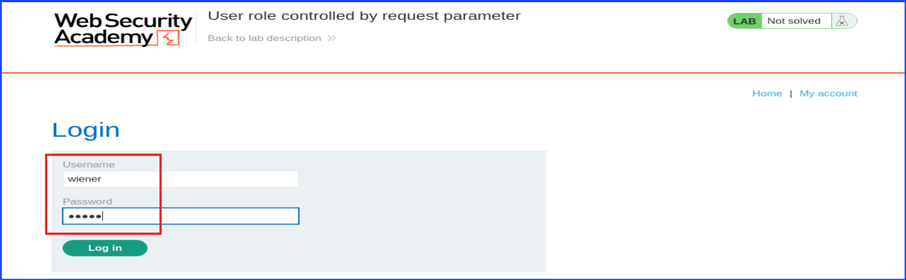

The screenshot below showed a successful attempt at login into the provided account with username wiener. One thing to notice was that at this point the URL parameter has `id=wiener` appended at the end.

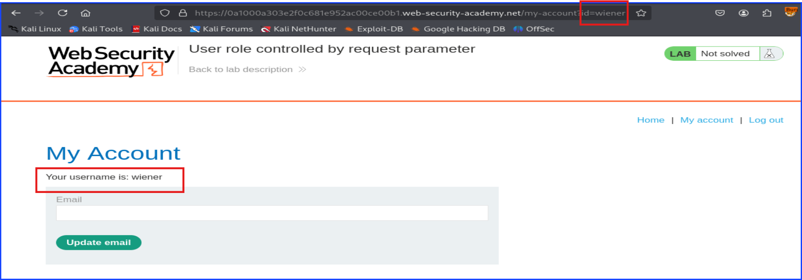

I believe this part served as a good learning for a beginner so included this. It is to be noted that this lab was about **User role controlled by request parameter**. This hinted that we need to modify something related to *request parameter*.

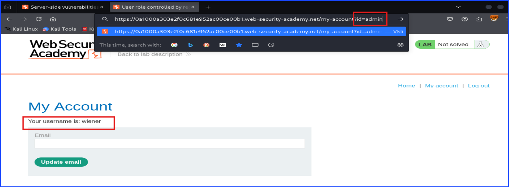

I captured this request with Burp Suite as shown below.
As you can see, the admin's cookie was **admin=false**.
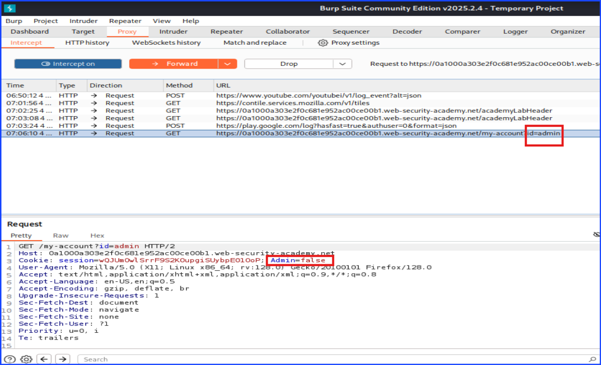

I tried changing the ***admin=false*** into ***admin=true*** before sending. It seemed the server refused to let me login as admin so I have to move onto another page to perform this attack.

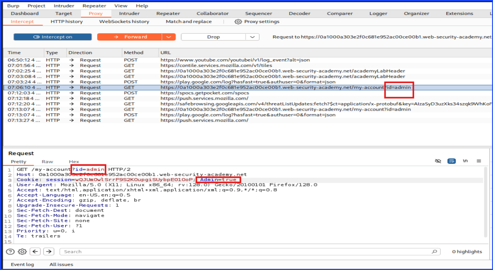

Still logging in as user wiener, I navigated to `/admin` page. Upon catching the traffic with Burp, there is a cookie called ***Admin=false***. It is noted that without logging in as wiener, I wouldn't see the cookie: ***Admin=false*** in the first place. Another point to note was that this time I attacked `/admin` page instead of trying to manipulate `id=wiener` into `id=admin`. Believe me I did that but it did not lead me to solve this lab and will cause further confusion so I did not inclued them here.

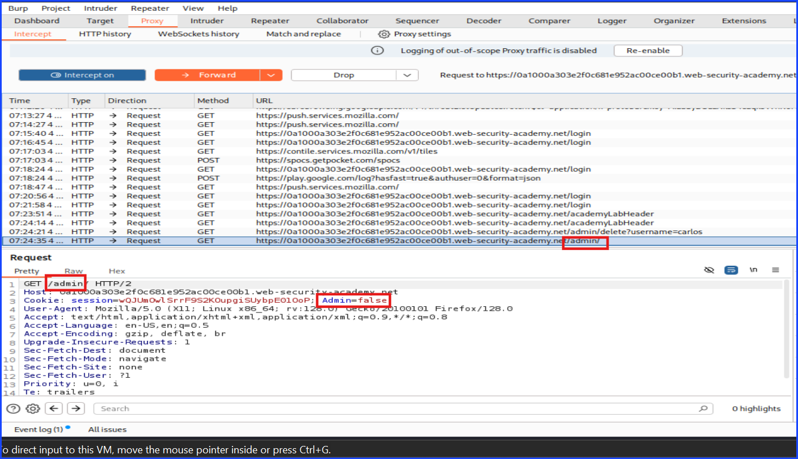

Now I changed the `Admin=false` to `Admin=true` on `/admin` page before hitting the ***send*** button on Burp.

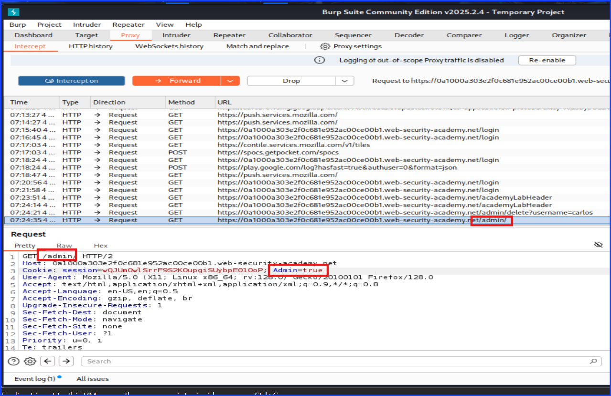

As you can see in the screenshot below, I was able to access the admin page and able to see other users. Next, I clicked delete Carlos. Don't forget to capture the traffic through Burp. We still need to use Burp.

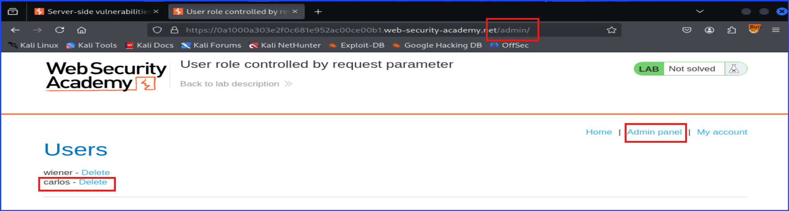

Take a look at the below screenshot, you can see that while I was trying to delete user ***Carlos***, I still needed to be admin to do it. I still got the ***Admin=false*** in the request. If I sent the request right away without changing its value, I would not be able to delete ***Carlos***.

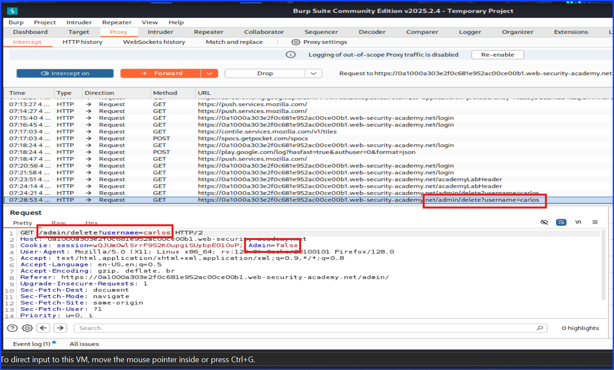

Upon capturing the request, I had to change the ***Admin=false*** to ***Admin=true*** again in order to delete the user ***Carlos***. The reason that we had to do this again was because we needed to have the permission to do so which by performing the attack as an administrator. This is why this attack is dangerous -- because an attacker, me, can trick the server to allow me to login as an administrator so I could perform a dangerous action.

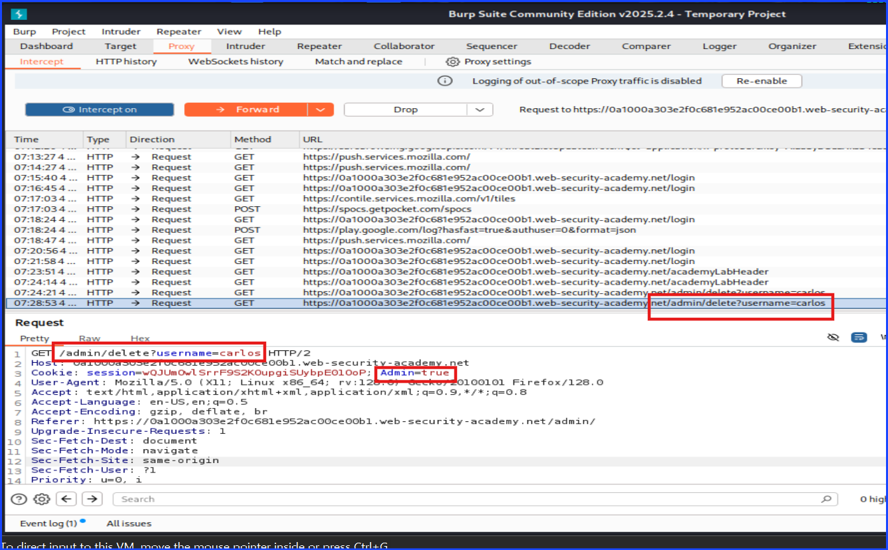

As you can see, this lab is solved.

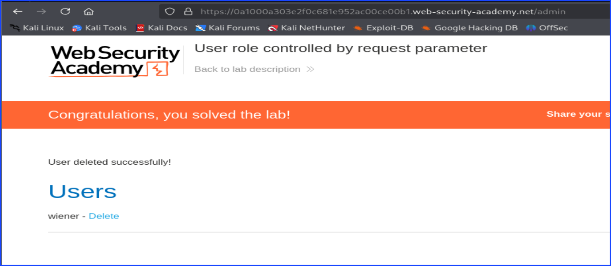

## Mitigations Strategies
