# Access Control Lab 4: User ID controlled by request parameter, with unpredictable user IDs

***Port Swigger Accademy Lab***

After navigating to the lab's URL, I logged into `My Account` using the provided credential, `wiener:peter`.

After I logged into Wiener's account, I noticed Wiener's API-Key clearly visible.

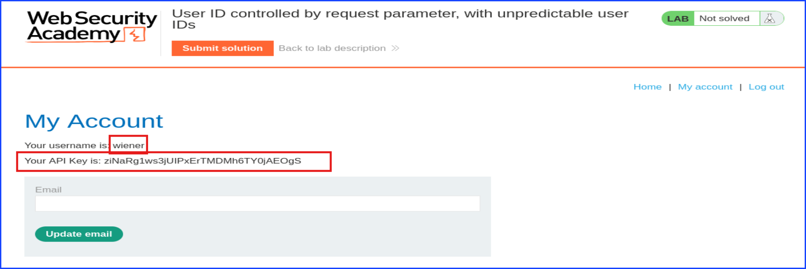

Then, browsed around the blog searching for one of Carlos's posts. The below showed that I found a post that was posted by Carlos.

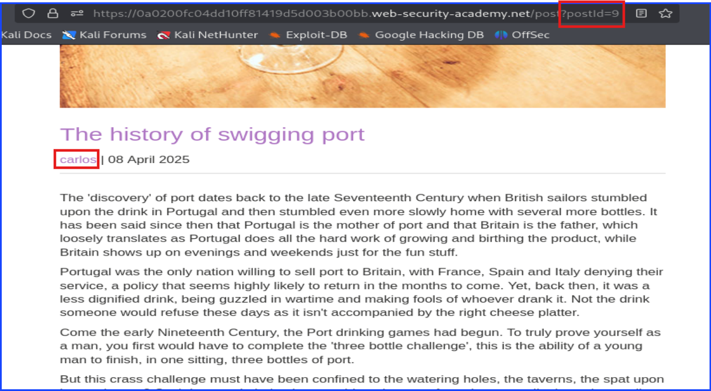

After that I clicked on Carlos's name on his post and saw that the `id=9` parameter can access another parameter. Since I use Burp to listen and intercept traffic, I needed to release the captured request by pressing `forward` on Burp.

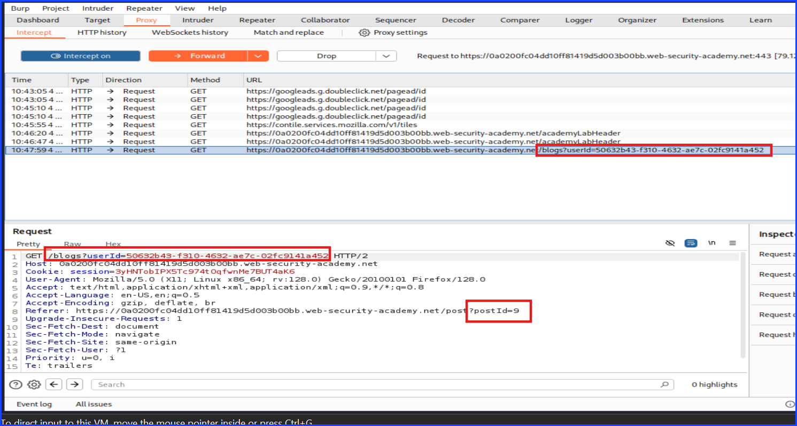

The below screenshot was my attempt to keep a record of both Carlos's and Wiener's userID in one screen on Burp Repeater.

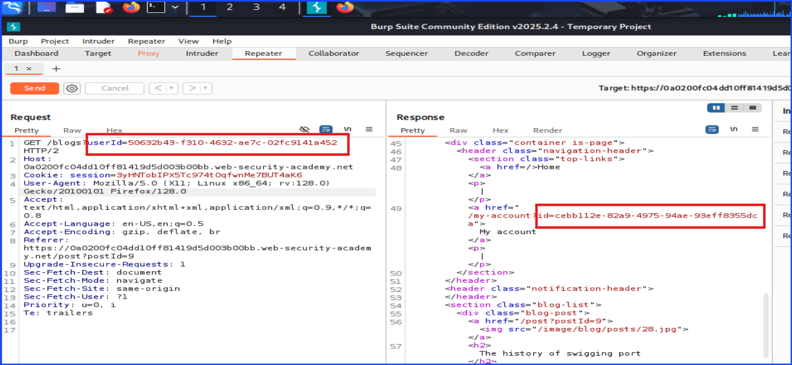

Take note of Carlos's userID on the Proxy Tab on Burp. Copy it. It will be useful later.

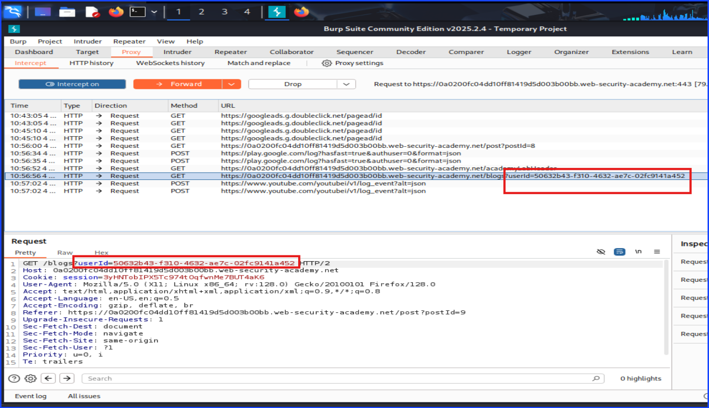

Next, I went back to Wiener account page, my account. I noticed that the URL parameter showed ID which was Wiener's userID.

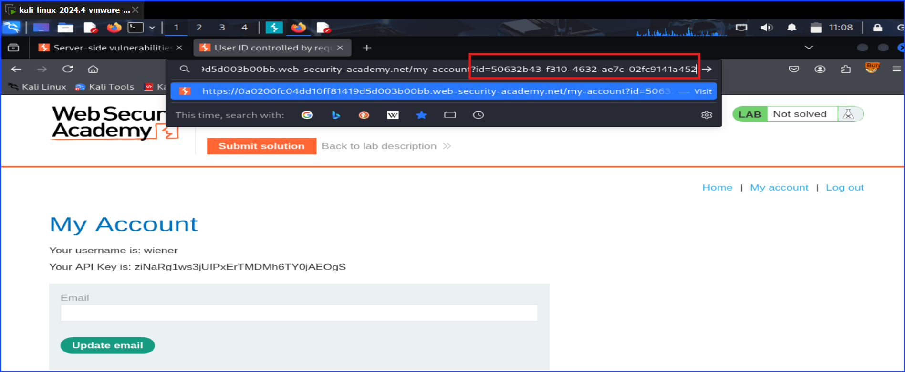

Then, I replaced Wiener's ID with Carlos's and hit `forward`.

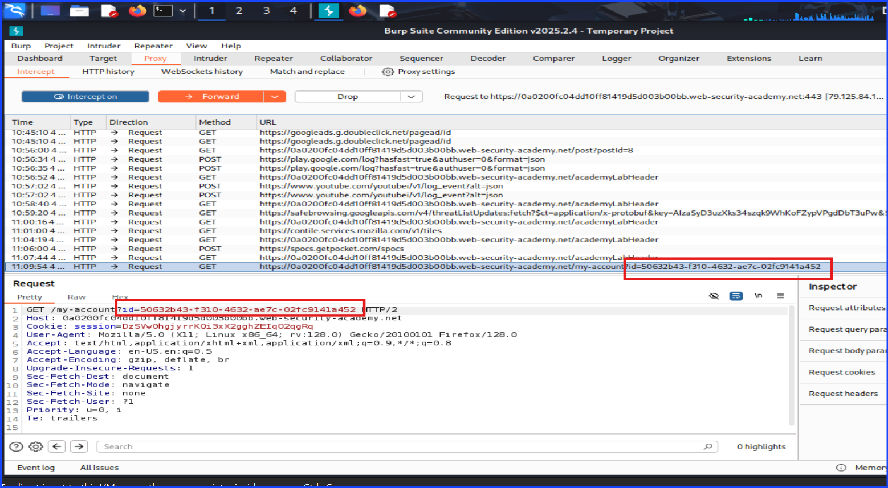

The result was I got access to Carlos's account and able to see Carlos's API-Key.

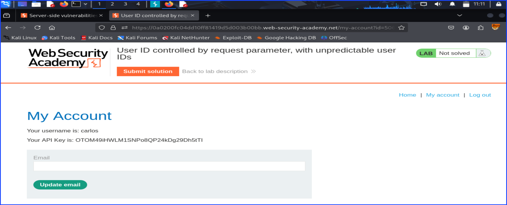

Copy Carlos's API-Key and submit it as shown in the below screenshot.

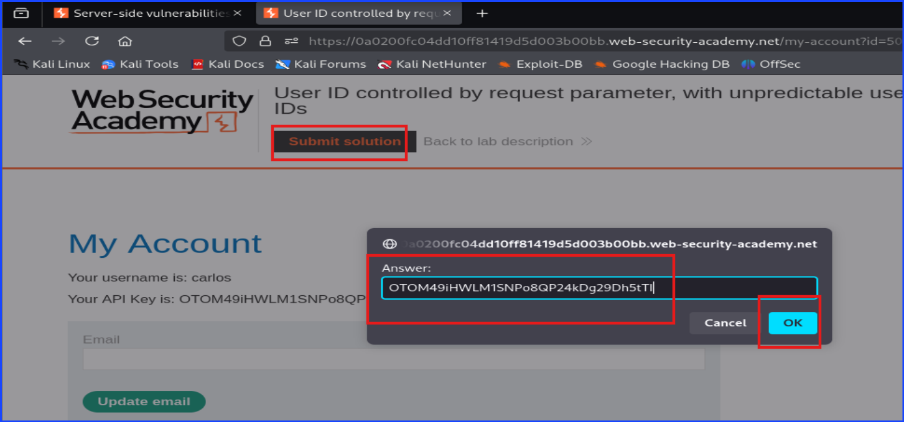

Now the lab was solved.

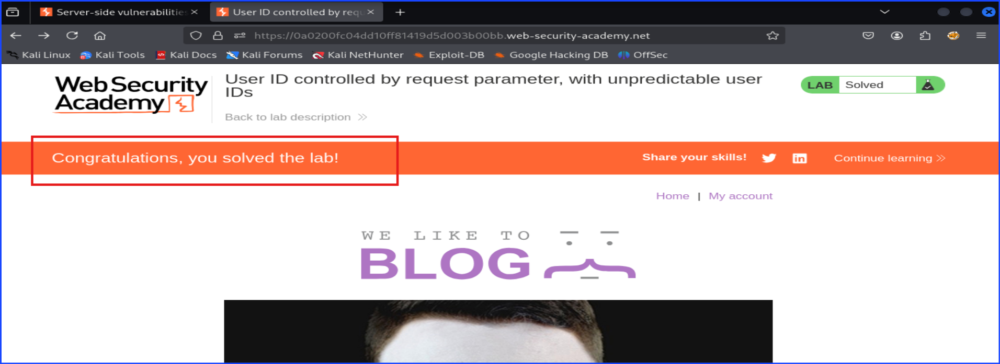

Here is a tiny tip. Keep a note along the way helped even though I took a lot of screenshots along the way.

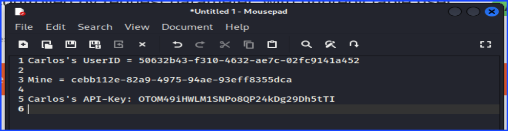

## Mitigations Strategies
