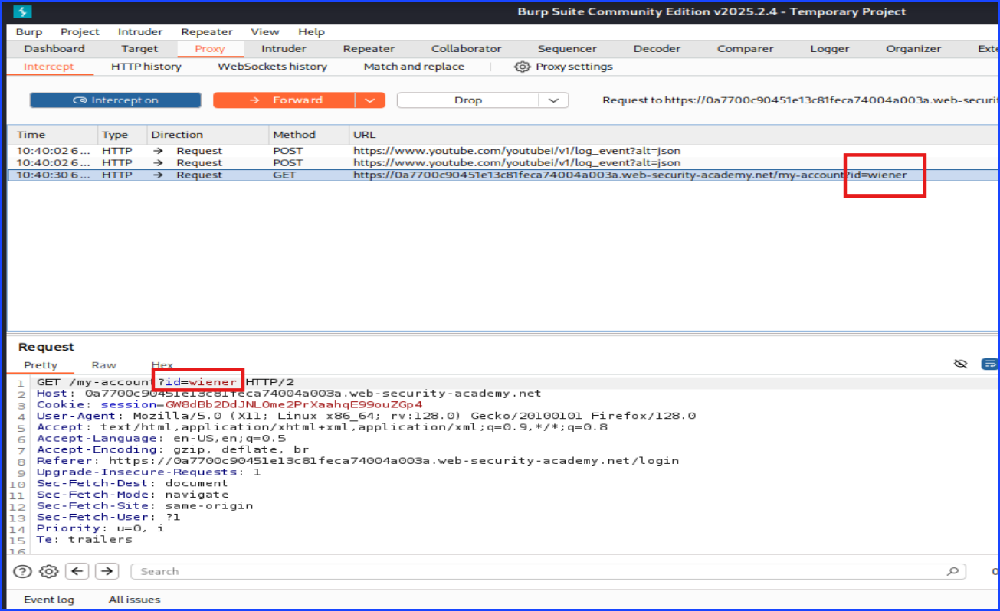
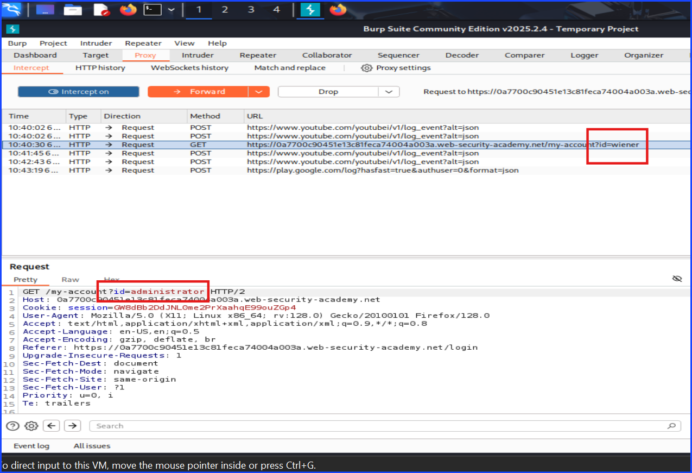
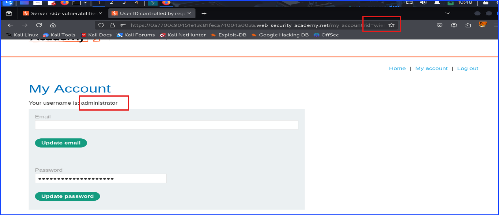
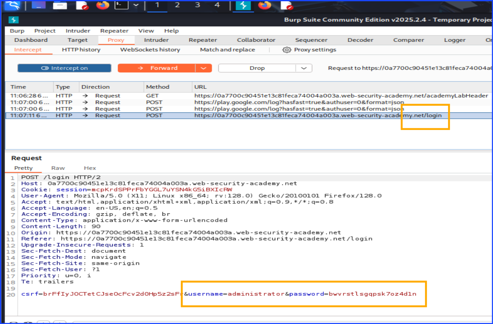
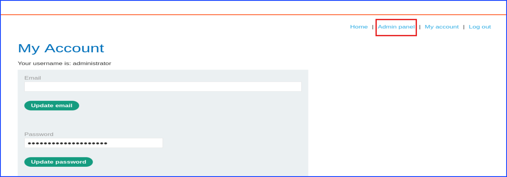
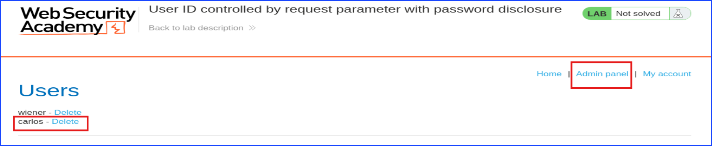
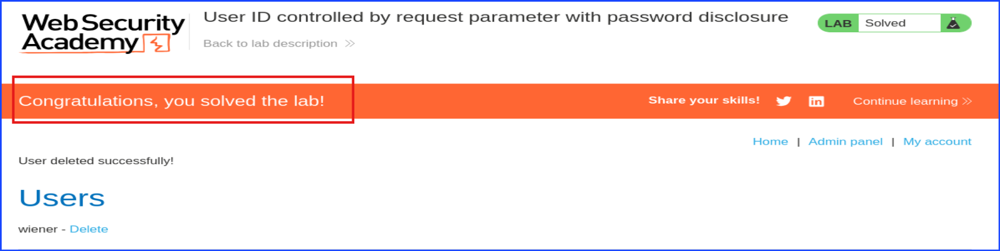
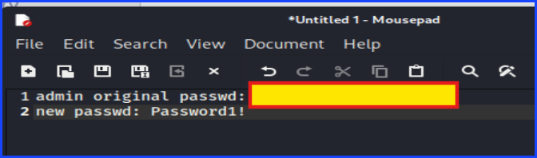

# Lab 5: User ID Controlled By Request Parameter With Password Disclosure

**Lab:** Port Swigger Academy

After navigating to the lab website, I navigated to the `My Account` and login using the credential provided as `wiener`.

As you can see, the below screenshot showed the request captured on Burp. Noticed that the URL was `/my-account/id=wiener`.

From this point, I changed the `id` from `wiener`to `administrator` to login as administrator.

As you can see in the below screenshot, the `id` in the request was changed into `administrator` but the URL was still `id=wiener`.

This allowed me to see the administrator account logging in as well as the password. All I did was copy the password from here.

Now, I logged out from `wiener` and re-logged in as the administrator in the username field and used the password I obtained from the previous steps to login as shown in the screenshot below.

Access the admin panel.

Now that I can access admin panel, I can delete the user Carlos.

User Carlos is successfully deleted and I solved the lab.

In addition to the above, I also test changing the administrator account's password to see if I was capable of doing it and see that I could.
As you can see in the noted below.

**Tip:** Taking a note along the way helps when I need to copy and paste something even though I take a lot of screenshots.

## Important Points

+ The password was shown and stored without salt which was easy to be stolen once I could gain access to the account the way I did. This is dangerous because I didn't even need to change the administor account's password. I was able to copy the password to log in as administrator without even needs to be the admin.
+ There were no 2FA checking if I were the admin or not. This means once I have obtained the password, I could login as the admin, change the admin account's password to prevent the real admin from logging in. Then, I could do any damanges I want within the admin's power such as delete another user, Carlos.

## Mitigation Strategies

+ Add 2FA or MFA to check when I login as the administrator account. This means if I could not verify myself through the MFA, the system can assume that I am not the real admin. This will protect the admin account from being logged in by someone who should not be able to do so.
  + This can be another OTP generator app or a one click approval from another device similar to when I logged into Facebook on my computer and the system told me to approve it from my other device that is already logged in.
+ Not only the login needs the authorization either by using 2FA, MFA, or one-click approval, if the admin account perform any actions that can be impactful to the system such as changing the account password or delete a regular user, there should be another one of those authentication check as well. I saw it being implement in Zoho business email the free version.

---

**Written by:** Sangsongthong C.
**Publishing date:** 11 May 2025
