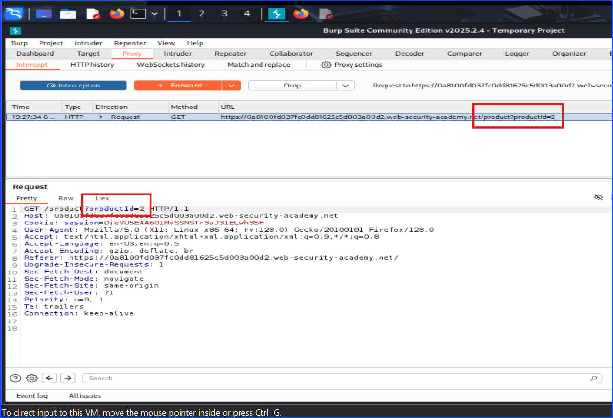
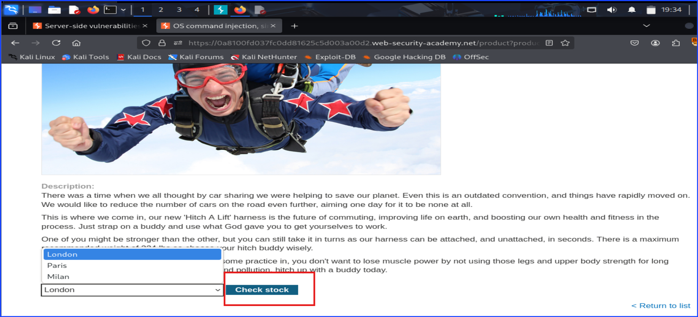
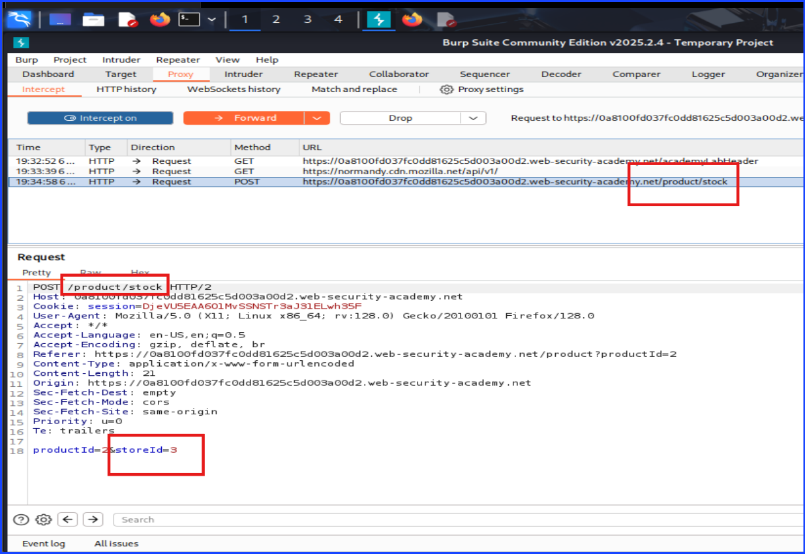

# Lab: OS Command Injection, Simple Case

**Lab:** Port Swigger Academy

Capture the request on Burp and make changes in the `storeID`'s value by adding `|whoami &` at the end to trick the server to show the result of the `whoami` command. If the server displays the result on the web page, it means the server was vulnerable to OS-Command Injection attack.

Before moving on, it is worth noting that the OS-Command Injection URL ended with `/product/stock` without showing something like `id=something`. This makes it different than the attack that users can modify the URL.

Another point to mention is the vulnerable code is written at the end of the source code as `storeID=number` and the `number` is the only thing that changes once I click on another product, but the change will not show on the URL form.

I have successfully tricked the server to reveal the result of running `whoami` command.

Getting this result is very important because it is a Proof of Concept (PoC) that this system has OS-Command Injection Vulnerability.

It also tell which user was the one running this page which can serve as the starting points for privilege escalation.

The screenshot below showed that I have successfully completed this lab.

The last two screenshots below were just me testing the page using the command `echo` to make it showed something that does not belong to the web server out of my own curiosity.

This one was the command I ran on Burp.

This one was the result of running the command in the previous screenshot.

---

**Author:** Sangsongthong C.
**Publish Date:**
