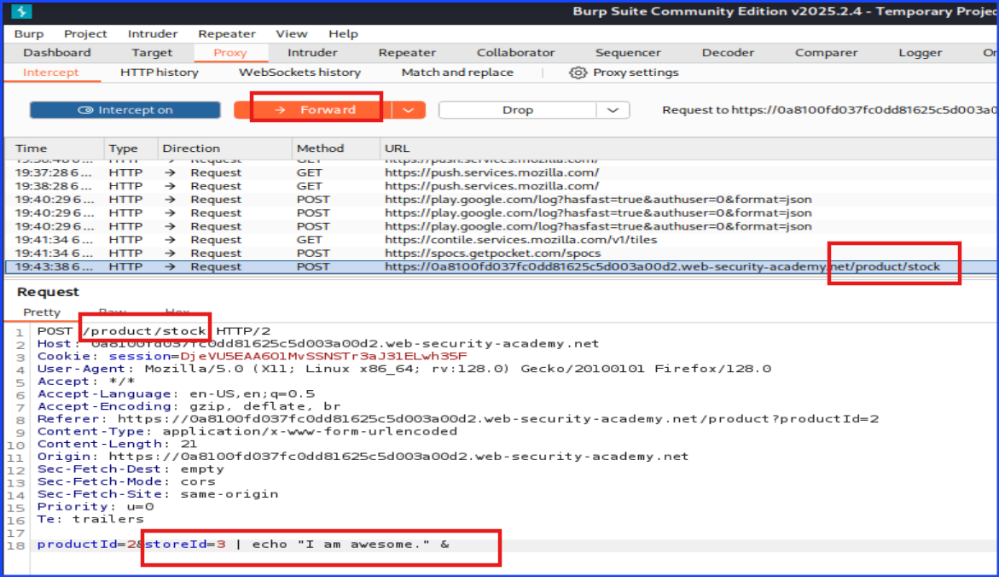

# Lab: OS Command Injection, Simple Case

**Lab:** Port Swigger Academy

Navigate to the lab URL. Note that the URL with the `productID=number` was not the correct one. Do not confuse it with the other attack vector. I put the first two screenshots here with this explanation so you won't get lost in it.

The below screenshot is the orginal of the incorrect attack vector.

The below screenshot is the previous screenshot after trying to add `| whoami &" and found that it didn't work.

On the product discription page, scroll down to see the choosing the store section. Pick one of them and click "Check Stock".

Capture the request on Burp. Take a look at the screenshot below, the box areas highlight the spot to test the OS-Command Injection.

You can see that the URL has to show something like `/product/stock` rather than `/product/stock=1`. If the URL uses `/product/stock=1`, then it can be a different type of attack.

In OS-Command Injection, the command is at the end of the captured request. This is where I want to spend time climbing.

Capture the request on Burp and make changes in the `storeID`'s value by adding `|whoami &` at the end to trick the server to show the result of the `whoami` command. If the server displays the result on the web page, it means the server was vulnerable to OS-Command Injection attack.

Before moving on, it is worth noting that the OS-Command Injection URL ended with `/product/stock` without showing something like `id=something`. This makes it different than the attack that users can modify the URL.

Another point to mention is the vulnerable code is written at the end of the source code as `storeID=number` and the `number` is the only thing that changes once I click on another product, but the change will not show on the URL form.

I have successfully tricked the server to reveal the result of running `whoami` command.

Getting this result is very important because it is a Proof of Concept (PoC) that this system has OS-Command Injection Vulnerability.

It also tell which user was the one running this page which can serve as the starting points for privilege escalation.

The screenshot below showed that I have successfully completed this lab.

The last two screenshots below were just me testing the page using the command `echo` to make it showed something that does not belong to the web server out of my own curiosity.

This one was the command I ran on Burp.

This one was the result of running the command in the previous screenshot.

## Mitigation Strategies

To prevent OS Command Injection vulnerabilities like the one exploited in this lab, developers and system administrators should implement the following security measures:

+ Avoid Using System Commands
  + Do not call OS commands from web applications unless absolutely necessary.
  + Use safer, language-native alternatives (e.g., file system or network libraries) instead of invoking shell commands.

+ Use Secure APIs
  + If system-level calls are unavoidable, use functions that do not invoke a shell (e.g., Pytho's `subprocess.run()` with `shell=False`, or Java's `ProcessBuilder`).

+ Validate and Sanitize Input
  + Strictly validate all user input using allow-lists (e.g., only allow numeric store IDs).
  + Sanitize inputs to ensure no special characters (like `|`, `&`, `;`, etc.) are passed to command-line calls.

+ Use Least Privilege
  + Run the web server and backend processes with the least privileges necessary to limit potential damage if exploited.

+ Apply Output Encoding
  + Encode user-controlled outputs displayed on the web interface to avoid other forms of injection attacks like XSS, which may aid chaining with command injection.

+ Web Application Firewall (WAF)
  + Deploy a WAF that can help detect and block basic injection patterns at the network edge.

+ Security Testing and Code Reviews
  + Conduct regular penetration testing, especially on endpoints accepting user input.
  + Include static analysis and secure code reviews as part of the development lifecycle.

---

**Author:** Sangsongthong C.
**Publish Date:** 29 May 2025
