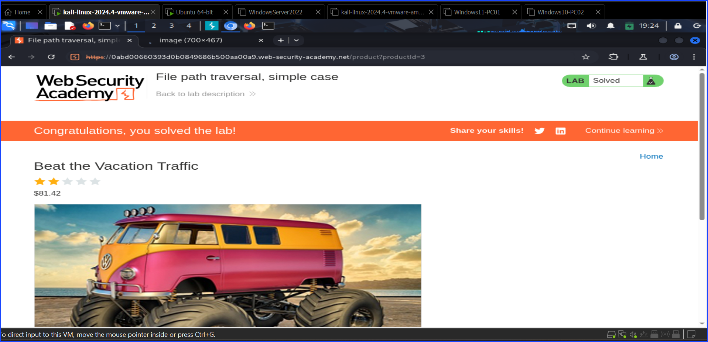
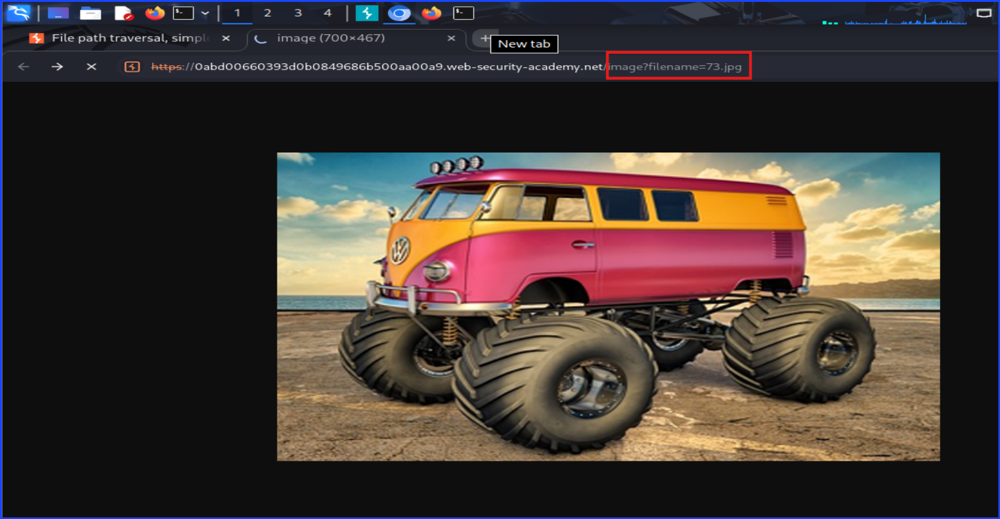
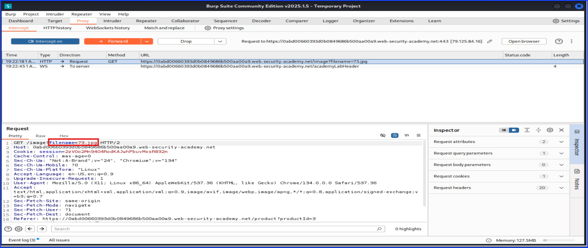
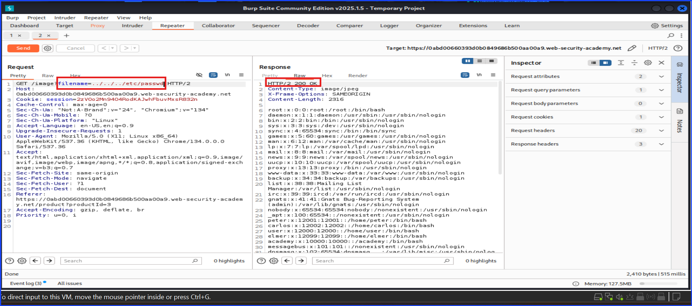

# Lab: File Path Traversal Simple Case

I started off with reading through the content of the lab on Port Swigger's Web Security Academy and navigated to the lab URL.

File Path Traversal is one of low hanging fruits attack vectors which is easy to look for in a web application penetration testing. The core idea is that an insecure website will allow outsiders who are not the dev team to have access to the data of the system that they should not be able to access.

The way to check it is simple. Manually typing `../../../etc/passwd` is usually do the trick. The `../../../` tells the linux server to travel back 3 directories to be in the `/` directory. For a Windows server, `\` is often used.

The `/etc/passwd` after that tells the server that after reaching the `/`, travel to `/etc` directory, look for the filename `passwd`, and shows the result.

Here comes the important things, you can't just add `../../../etc/passwd`anywhere in the website and expect it will work right away. The trick is to only use this method at a file on the website. I used to understand about the `../../../etc/passwd`, but not know where to put it. Now I understand that.

Let's pay attention to the lab website. I tried to add it to the lab's url and it did not work. I navigated to one of the displayed items and tried to add that into the URL and it did not work.

The screenshot below shows that I am in the displayed an item area. While you think this is the right place to add the `../../../etc/passwd` because it shows a file, it is not the correct place to add it.

The below screenshot is the correct place to add it. I reached this by right click on the displayed image and clicked open image in a new tab.

As you can see, the red rectangular box in the image shows the filename.jpg.

To make this work, open Burp Suite and capture the traffic. The screenshot below shows the unmodified traffic captured by Burp Suite. The red box shows the location of the thing traffic that needs to be modified.

I used to see old walkthroughs in a CTF such as TryHackMe and HackTheBox made some change to the path directly on the web browser, but that is no longer applicable to the newer web browser versions. However, you can still modify it using Burp Suite.

Here is after I modify and send it. I prefer to send from the repeater in case I screw up I can re-send it again.

As you can see, I was able to make the system reveals the content inside `/etc/passwd` which contains user account information such as usernames, user IDs, and home directories.

However, this file does not store passwords. In modern Linux systems, passwords hashes are stored separately in `/etc/shadows`, which requires higher privileges to access.

## Mitigation

Coming soon!

**Reference:** [Port Swigger File Path Traversal](https://portswigger.net/web-security/file-path-traversal)
