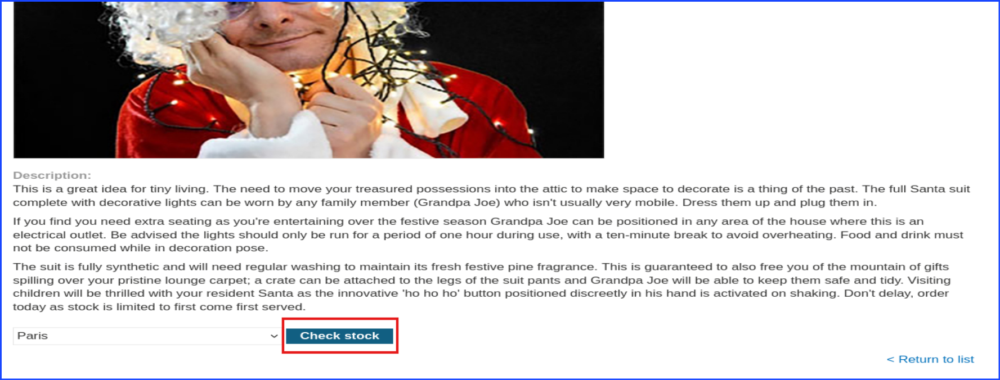
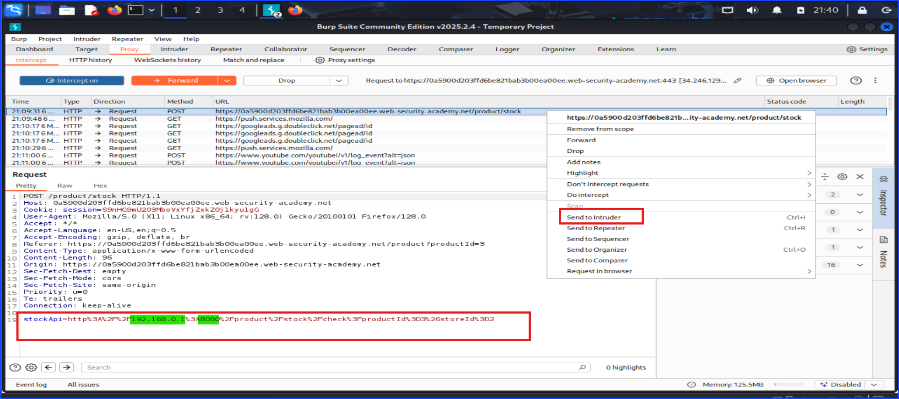
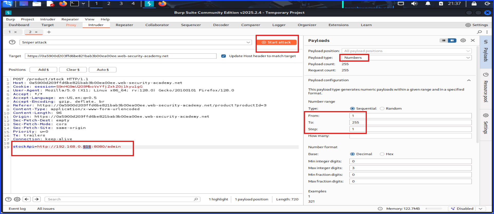
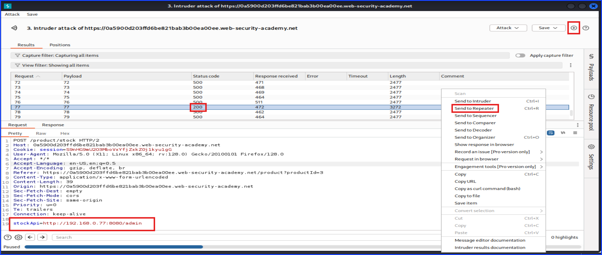
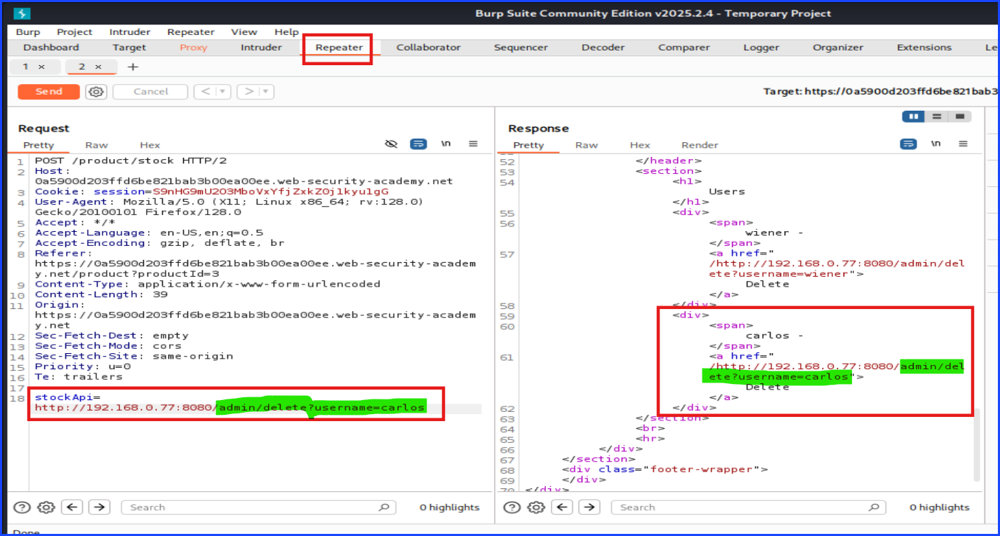
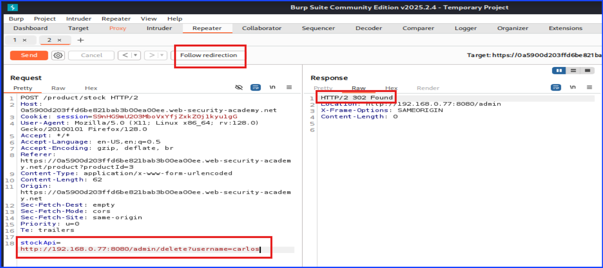
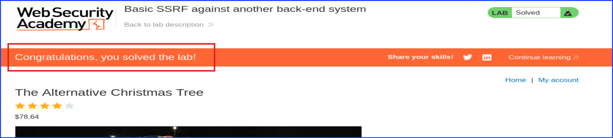

# Lab: Server Side Request Forgery: (SSRF)

## Lab 2: Basic SSRF against another back-end system

### Port Swigger Academy

Starting off by navigating to the lab URL. Then, navigate to one of the product page. Once you are there, scroll down until you see the `Check stock` button as shown in the below screenshot.

Setup `Burp Suite` to capture the request before selecting the store location, in my case I chose Paris, and clicking the `Check stock` button to send the request and capture it with `Burp Suite`.

The screenshot below shows `stockApi` value. Take a closer look at the value, you can see the target IP and the port in the value. They are highlighted in green.

Also, send this request to `Intruder` to perform further attack.

On the screenshot below is the `Intruder` screen from `Burp Suite`.

I chose the `Sniper` as the attack type. Then, add the last part of the IP address in the stockApi (the 1 from 192.168.0.1) as the point to fuzz.

Take a look on the right side of the screen. This is where I set the `payloads`. Set the payload type to `Numbers` and specify it to be from `1` to `255`. Then hit the `Start Attack` button and wait for the `200` to show up.

The idea is to use `Burp Suite`'s `Intruder` function with the `Sniper` as the attack type to fuzz the last digit of the IP address from 1-225 and try to find the one that respond with `200`.

The below screenshot shows the `200` result. After getting this result, I sent it to the `Repeater` for further attack.

On the `Repeater` tab, scroll down on the response to see the part of the source code mentioning about deleting the user Carlos.

Add that part to the `stockApi` as shown with the green highlight and hit `Send`.

The idea is to trick the `stockApi` to allow me to access the `/admin` page as well as allowing me to perform an important administrator level task like deleting a user, Carlos, without checking that I have no right to do so.

Note that this part can also be completed in the web browser if I send it to the `Proxy` instead of the `Repeater`.

Follow the direction as shown below since every request is still get captured by `Burp Suite`.

I successfully able to delete the user Carlos and solved the lab.

## Mitigation Strategies

---

Author: Sangsongthong C.
Publishing Date:
