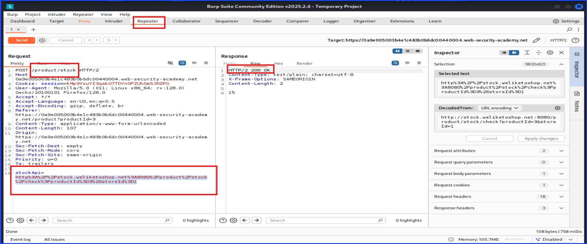

# Lab: Server Side Request Forgery: (SSRF)

## Port Swigger Academy

I will write about lab 1 and lab 2 together in one file since they are not long. I just took a lot of screenshots to be thourough.

## Lab 1: Basic SSRF Against The Local Server

## Lab 2: Basic SSRF Against Another Bad-end System

