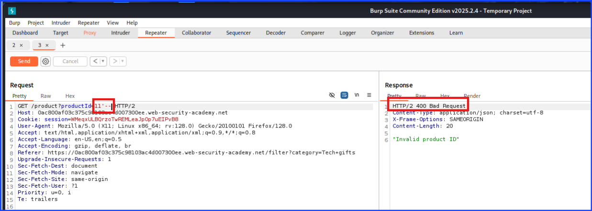
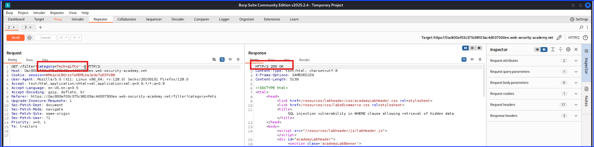
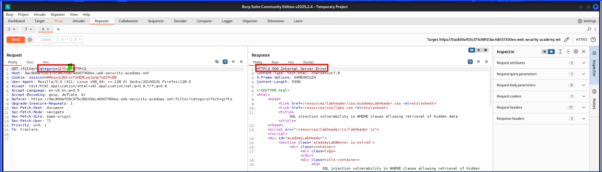
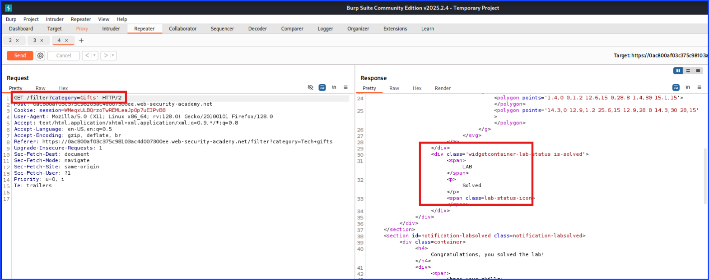
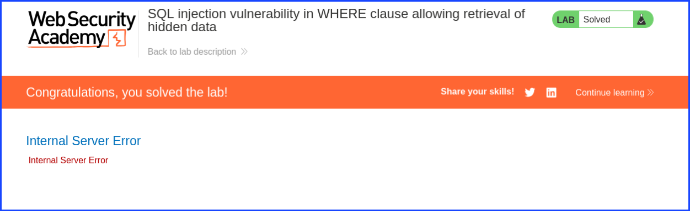
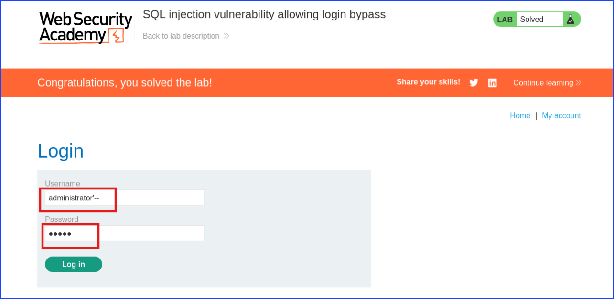
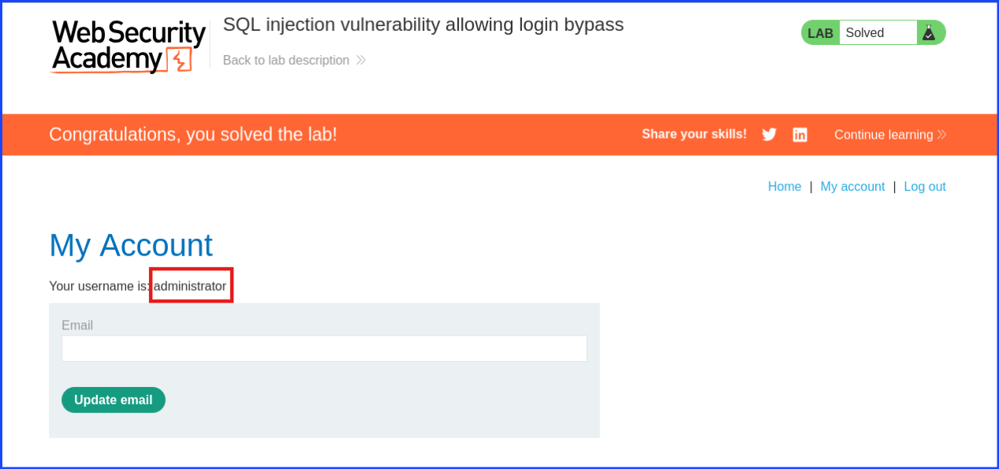

# SQL Injection

## Labs 1

I started off by navigating to the lab. There, I encounter a website.

The idea of this exploiting this website with SQL injection is to trick the server to show something that it shouldn't by making changes to the `category` parameter.

In my past experience, I got stuck and confused many times of where I should apply this injection to. The below screenshot showed that this parameter, `productID`, was not vulnerable to this type of SQL injection.

Don't be discouraged if you encountered the `404` status code that told you that this code wasn't vulnerable to SQL injection because this injection is a target specific. This means one part of the website may not be vulnerable to it, but it does not mean that the whole website will be fully secured from from this vulnerable as shown in the next screenshot.

After trying the SQL injection with the `productID` and found that it was secured from my attack, I moved on to test another parameter.

The screenshot below shows that the `category` parameter was vulnerable to this SQL injection. As you can see, I proved it by adding the `'--` after the `category`'s value and the server still response with `200` which indicate that there was no filter or any security measurement in place to prevent me from performing SQL injection to this line of code.

Then, I added this `'` to the end of the `category`'s value to make the server showed `500` status code which indicated that the server was tricked to show something it shouldn't.

The below screenshots show that I have successfully solved this lab by making the server send out the `500` error code.

This one showed my success through the response code on Burp Suite.

This one in particular showed my successful attempt on the browser.

Since this lab was short and easy, let's move on to lab 2.

## Lab 2

After navigating to the lab's website, this lab said it was about using SQL injection to bypass a login form. With this information in mind, I navigated to the login page.

The below screenshot was a login page showing the login field.

Let's take a closer look at the login field. This login field consisted of the Username and Password field.

My goal is to log into the administrator account without knowing the password.

To do that I need to add the `'` at the end of the username. In this case the username is `administrator`. This means that on the `Username` field, I will have `administrator` + `'` = `administrator'` on that field as shown in the screenshot below.

As for the password, this form prompted me to type in the password so I did. Since the function of the `'` was to make the `Username` be the only parameter that matters and tricked the server to ignore the rest of the code thinking that it was just the comment; this means I can just type whatever I wanted on the password field to satisfy the requirement checked by the browser instead of leaving it blank.

I typed whatever I wanted in the password field without even looking and it worked.

The screenshot below showed that I was successfully able to bypass the login page and login as administrator without needing to know the password.

This screenshot was also the evidence that I have solved the lab.

---

**Author & Publisher:** Sangsongthong Chantaranothai

**Date Published:** 30 April 2025
*(Based on the commit where the full walkthrough was completed. Later commits are minor edits or additions.)*

**Purpose:** Created as part of ongoing professional development to earn CEU/CPE credits for CompTIA and ISC2 certifications. Also intended to showcase cybersecurity skills, support Hexterika Cyberlab's portfolio, and demonstrate project quality to future clients and employers.

***Published as part of Hexterika Cyberlab, the cybersecurity division of Hexterika Breaks Free.***

🔐 Part of the [Hexterika Cyberlab](https://hexterika-breaks-free.website/cyberlab.html) project series  
📎 Website coming soon at [Hexterika Breaks Free](https://hexterika-breaks-free.website)

***Latest content edit:*** *30 April 2025 (Content edit only - exclude any minor format or typo fixed.)*
