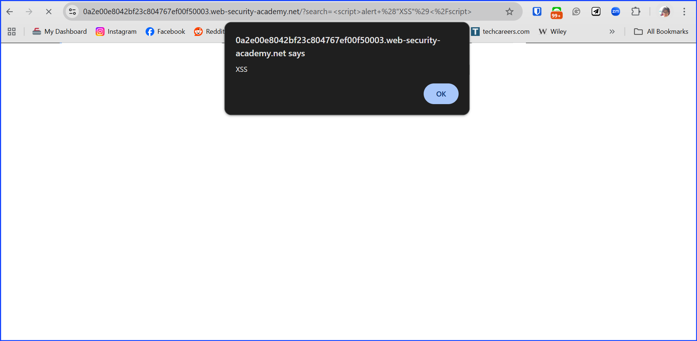
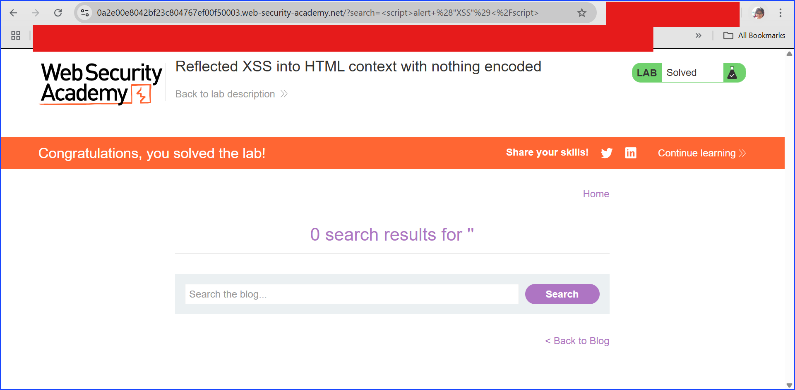

# Lab: Reflected XSS into HTML Contect With Nothing Encode

This is the most basic form of reflected XSS testing. In this lab, there was no security measure implemented at all. The alert script is the conceptual check test. If the server responded to it, it means there is XSS vulnerability.

I added `` on the URL bar on the lab and the server popped out the alert message.

